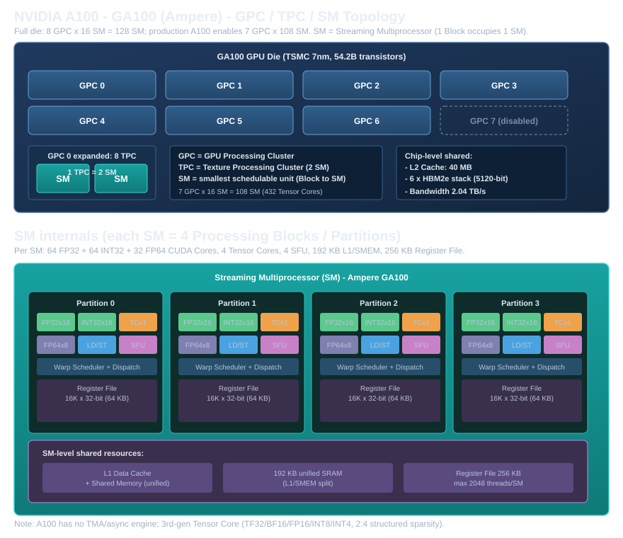

# NVIDIA Ampere A100（GA100）硬件结构深度解析

> 本手册是 [Part 1 概述](../part01-gpu-hardware-architecture.md) 的扩展篇，属于「逐型号 GPGPU 硬件结构」系列之一。同系列还有 [Hopper H100](./02-hopper-h100.md) 与 [Blackwell B200](./03-blackwell-b200.md)。
>
> 约定：本部分**不出现 CUDA 代码**，只讲硬件结构、硬件 Feature，以及「算力从哪来」的一次拆解。所有算力数字都会给出**根据硬件单元数量 × 频率的计算公式**，并标注官方来源。你读到任何一个峰值数字时，都应该能反推出它背后的乘法。

## 0. 定位：A100 是一颗"算力密度优先"的 Ampere 旗舰

A100（完整代号 GA100）发布于 2020 年，是 Ampere 架构的数据中心旗舰，也是**"从 Volta/Turing 的 Tensor Core 验证时代，进入规模化 AI 计算时代"的分水岭**。相对上一代 V100，它最核心的诉求是把**矩阵乘法算力密度**再拉高一个数量级，同时第一次系统性正面回应"算力涨上来了，怎么把数据喂饱"这个矛盾——所以它带来了 `cp.async`（异步拷贝）、TF32/BF16 两种新格式、2:4 结构化稀疏，以及更灵活的 L2 Cache。它是 [roadmap](../roadmap-ampere-hopper-blackwell.md) 里 Track 1 的硬件本体。

一句话总结 A100 的三大硬件主线：

1. **算力**：第 3 代 Tensor Core，支持 TF32 / BF16 / FP16 / INT8 / INT4，带 2:4 结构化稀疏。
2. **搬运**：`cp.async`（全局→共享内存异步拷贝，去掉"路过寄存器"这一步）。
3. **灵活性**：L2 可配置常驻区域、MIG（多实例 GPU）硬件级切分。

下面从大到小，从芯片拓扑到 SM 内部，再到算力公式。

## 1. 芯片拓扑：GPC → TPC → SM



GA100 完整 die 的层次结构如下（与 Part 1 §1.2 的通用结构图一一对应）：

| 层级                   | 完整 die（GA100） | 量产 A100     | 说明                       |
| ---------------------- | ----------------- | ------------- | -------------------------- |
| GPC                    | 8                 | **7**   | 每个 GPC 是最大物理分区    |
| TPC                    | 8 × 8 = 64       | 7 × 8 = 56   | 1 TPC = 2 SM               |
| SM                     | 128               | **108** | 量产禁用 1 个 GPC（20 SM） |
| FP32 CUDA Core         | 8192              | 6912          | 每 SM 64 个                |
| FP64 CUDA Core         | 4096              | 3456          | 每 SM 32 个（半速率）      |
| INT32 Core             | 4096→6192        | 6912          | 与 FP32 同数量             |
| Tensor Core（第 3 代） | 512               | **432** | 每 SM 4 个                 |

> 来源：[NVIDIA A100 80GB 数据表](https://www.nvidia.com/en-gb/data-center/a100/)（FP64 9.7 / FP32 19.5 / TF32 156 / FP16 312 / INT8 624）；SM/Tensor Core 数量见 [Hopper In-Depth 官方博客的 A100 对照表](https://developer.nvidia.com/blog/nvidia-hopper-architecture-in-depth/)。GA100 完整 die 是 8 GPC × 16 SM，量产屏蔽 1 个 GPC（对应 7 GPC × 108 SM），[theaicipher](https://theaicipher.com/nvidia-a100-gpu-specs-architecture-guide/) 明确列了完整 die 与量产 SKU 的差异。

### 1.1 A100 的 FP32 配置：每 SM 64 个，干净独立

A100（数据中心 GA100）每 SM 有 **64 个 FP32 core + 64 个 INT32 core**，两者是**各自独立的通路**。注意：这个 64+64 分立布局**不同于消费级 Ampere（RTX 30 系列的 GA10x）**——后者才是那个"128 个 FP32/INT32 混合数据通路、每时钟二选一发射"的设计。GA100 数据中心芯片用的是干净的分立 64 FP32 + 64 INT32。

这个区别很重要，因为它直接决定了 Hopper 的改进思路（见 H100 手册 §2.1）：**H100 把 FP32 通路直接翻倍到 128/SM**，INT32 保持 64/SM——于是"FP32 core 翻倍"这件事，在数据中心产品线上就是从 A100 的 64 → H100 的 128 的一条清晰轨迹。

> 具体数字：A100 每 SM = 64 FP32 + 64 INT32（各自独立 issue），数据见 [Hopper In-Depth 官方博客的 A100 对照表](https://developer.nvidia.com/blog/nvidia-hopper-architecture-in-depth/)（明确列出 A100 "FP32 Cores / SM = 64"、"INT32 Cores / SM = 64"）。6912 个 FP32 = 108 SM × 64，与官方一致。

## 2. SM（Streaming Multiprocessor）内部结构

每个 A100 SM 由 **4 个 Processing Block（Partition）**组成，每个 Partition 拥有：

| 每个 Partition         | 数量 | 说明                                      |
| ---------------------- | ---- | ----------------------------------------- |
| FP32 CUDA Core         | 16   | 4 个 Partition × 16 = 64/SM              |
| INT32 Core             | 16   | 与 FP32 共享 issue 端口                   |
| FP64 Core              | 8    | 4 × 8 = 32/SM（FP64 恒为 FP32 一半速率） |
| Tensor Core（第 3 代） | 1    | 4 × 1 = 4/SM                             |
| SFU（超函数单元）      | 1    | 4 × 1 = 4/SM                             |
| LD/ST Unit             | 1    | 访存地址生成、合访判断                    |
| Warp Scheduler         | 1    | 每 Partition 一个，共 4/SM                |

SM 级共享资源：

| 资源                         | 容量                             | 说明                        |
| ---------------------------- | -------------------------------- | --------------------------- |
| L1 / Shared Memory 合并 SRAM | **192 KB**（可配）         | 最多 164 KB 给 SMEM         |
| 寄存器堆                     | **256 KB** = 64K 个 32-bit | 供最多 2048 线程/Block 使用 |
| L2 Cache（芯片级）           | 40 MB                            | 全 GPU 共享                 |

> **注意 192 KB / SM 的 L1+SMEM 与 256 KB 寄存器堆这两组数字**：寄存器堆 256 KB 这个数字从 Kepler（2012）到 Hopper（2022）一直没变过，这个"十年不涨的寄存器堆"正是后来 Hopper（Warp Group）和 Blackwell（TMEM）两次「累加器装不下」问题的根源，详见 H100/B200 手册的对应章节。

## 3. Tensor Core（第 3 代）：矩阵乘加的专用电路

Tensor Core 从 Volta 引入（第 1 代），A100 是**第 3 代**。它的本质是 Part 5 会详细讲的"固定形状矩阵 multiply-accumulate（MMA）专用电路"，这里只讲硬件 Feature：

1. **新增 TF32**：19-bit 的 Tensor Float 32，输入截断 FP32 的尾数（8-bit 指数 + 10-bit 尾数），用 FP32 累加。这是"训练场景零修改加速"的关键——FP32 用户几乎不用改代码，就能用 Tensor Core 拿到 8× 于 FP32 CUDA Core 的峰值。
2. **BF16 与 FP16 同速率**：两者都是 312 TFLOPS（稠密），因为算法上都是 2-byte 输入。
3. **2:4 结构化稀疏**：每 4 个权重里至少 2 个为 0，硬件直接跳过零，峰值翻倍（如 FP16 312→624）。这是"硬件级结构化稀疏加速"的首次大规模落地。
4. **MMA 形状**：`m16n8k8` / `m16n8k16` 是主力的 `mma.sync` 形状（FP16），TF32 用 `m16n8k8`。细节见 Part 5 §5.4。

### 3.1 Tensor Core 每时钟 FMA：为什么是 1024/SM？

§4 的峰值公式里有一个关键输入——**每 SM 每时钟能做多少个 FP16 FMA**。这个数字官方数据表不会直接写，需要从「指令形状」和「硬件吞吐」两头对账推出来。

**第一步：看指令层面——一条 `mma` 指令包含多少运算量？**

FP16 的主力指令 `mma.m16n8k16` 完成一次 16×8×16 的矩阵乘加。它包含的 MAC（乘累加）数是三个维度直接相乘：

```
MAC 数 = 16 × 8 × 16 = 2048 个 MAC（每个 MAC = 1 乘 + 1 加 = 2 FLOP）
```

**第二步：看硬件层面——Tensor Core 每个时钟吞吐多少？**

NVIDIA 对第 3 代 Tensor Core 给出的吞吐是：**每个 Tensor Core 每时钟 256 个 FP16 FMA**（FMA 与 MAC 在这里是同一个东西：一次融合乘加）。A100 每个 SM 有 4 个 Tensor Core（§2 的 Partition 表），所以：

```
1024 FMA/SM/时钟 = 4 个 Tensor Core × 256 FMA/时钟/个
```

> 来源：[theaicipher 的 A100 指南](https://theaicipher.com/nvidia-a100-gpu-specs-architecture-guide/)引述官方说法：A100 重新设计的 Tensor Core 每时钟每 core 做 256 FP16/FP32 FMA。

**第三步：两头对账——一条 `mma.m16n8k16` 要跑几个时钟？**

把第一步的运算量除以第二步的吞吐，得到一条指令的执行时间：

```
2048 MAC ÷ 1024 MAC/时钟（每 SM）= 2 个时钟
```

也就是说，一个 Warp 发出一条 `mma.m16n8k16`，整个 SM 的 4 个 Tensor Core 协同工作，**2 个时钟**就能消化完。这个「2 时钟」不是巧合——m16n8k16 这个指令形状本来就是照着「4 个 Tensor Core × 2 时钟」的吞吐设计的。

**第四步：用 1024 反推整卡峰值**（§4 的正式公式从这里来）：

```
FP16 峰值 = 108 SM × 1024 FMA/SM/时钟 × 2 FLOP/FMA × 1.41 GHz
         = 108 × 1024 × 2 × 1.41e9
         = 3.117e14 FLOP/s ≈ 312 TFLOPS ✅ 与官方一致
```

### 3.2 每种格式的吞吐比例（相对 FP16=1024 FMA/SM/时钟）

| 输入格式            | FMA/SM/时钟 | 相对 FP16 | A100 峰值（稠密） |
| ------------------- | ----------- | --------- | ----------------- |
| FP64（Tensor Core） | 64          | 0.0625×  | 19.5 TFLOPS       |
| TF32                | 512         | 0.5×     | 156 TFLOPS        |
| FP16 / BF16         | 1024        | 1×       | 312 TFLOPS        |
| INT8                | 2048        | 2×       | 624 TOPS          |
| INT4                | 4096        | 4×       | 1248 TOPS         |

这个表是理解三个型号「为什么低精度下探就能翻倍」的钥匙——**同样是那个 Tensor Core 电路，输入位宽越窄，一个时钟能塞进去的 MAC 就越多**。FP16→INT8 是位宽减半（吞吐 ×2），INT8→INT4 再减半（×2）。这条"精度↓、吞吐↑"的剪刀差，会一路贯穿到 H100 的 FP8、B200 的 FP4。

## 4. 算力公式：从硬件单元推导峰值

GPU 峰值算力的通用公式：

\[
\text{Peak FLOPS} = N_{\text{SM}} \times \text{FMA/时钟/SM} \times 2\ \text{FLOP/FMA} \times f_{\text{clock}}
\]

其中「FMA/时钟/SM」对 CUDA Core 和 Tensor Core 分别取值。下面把 A100（SXM4 80GB，boost 1410 MHz）的每一项都算出来。

### 4.1 CUDA Core（标量 FMA）

**FP32**（每 SM 64 个 FP32 core，每 core 每时钟 1 FMA）：

```
FP32 = 108 SM × 64 core/SM × 1 FMA/时钟 × 2 FLOP × 1.41 GHz
     = 108 × 64 × 2 × 1.41e9
     = 1.949e13 FLOP/s ≈ 19.5 TFLOPS ✅
```

**FP64**（每 SM 32 个 FP64 core，恒为 FP32 一半速率）：

```
FP64 = 108 × 32 × 2 × 1.41e9 = 9.74e12 ≈ 9.7 TFLOPS ✅
```

> 来源：19.5 / 9.7 均与 [NVIDIA 官方 A100 数据表](https://www.nvidia.com/en-gb/data-center/a100/) 完全一致。频率 1410 MHz 是 [Hopper In-Depth 对照表](https://developer.nvidia.com/blog/nvidia-hopper-architecture-in-depth/) 中标注的 A100 boost clock。

### 4.2 Tensor Core（矩阵 MMA）

**FP16 / BF16**（每 SM 1024 FMA/时钟）：

```
FP16 = 108 × 1024 × 2 × 1.41e9 = 3.117e14 ≈ 312 TFLOPS ✅
```

**TF32**（每 SM 512 FMA/时钟）：

```
TF32 = 108 × 512 × 2 × 1.41e9 = 1.559e14 ≈ 156 TFLOPS ✅
```

**INT8**（每 SM 2048 MAC/时钟，每个 MAC = 1 乘 + 1 加 = 2 个整数运算）：

```
INT8 = 108 × 2048 × 2 × 1.41e9 = 6.24e14 ≈ 624 TOPS ✅
```

**FP64 Tensor Core**（每 SM 64 FMA/时钟）：

```
FP64-TC = 108 × 64 × 2 × 1.41e9 = 1.949e13 ≈ 19.5 TFLOPS ✅
```

> **关于稀疏**：所有带 2:4 稀疏的格式，峰值再 ×2（FP16 624、TF32 312、INT8 1248）。稀疏加速的前提是权重满足"每 4 个连续元素里至少 2 个为 0"，实际收益依赖于稀疏程度。

### 4.3 一图总结：所有数字都能被"单元数 × 频率"解释

请看文末的 [跨型号算力对比图](../assets/gpgpu-compute-ladder.svg)，A100 那一列（橙色）的每个数字，都能用上面 §4.1/§4.2 里的公式精确复现。**记公式比记数字重要**——因为到了 Hopper/Blackwell，你只需要改动 `N_SM`、`FMA/时钟/SM`、`f_clock` 三个变量，就能自己推出官方没直接公布的数字。

## 5. 访存与互联（Roofline 的另一半）

算力只是 Roofline（Part 1 §1.6）的一半，另一半是带宽。A100 SXM4 关键访存参数：

| 项目     | 数值                     | 说明                     |
| -------- | ------------------------ | ------------------------ |
| 显存     | 80 GB HBM2e              | 5 个 HBM2e stack         |
| 带宽     | 2,039 GB/s（≈2.0 TB/s） | 5120-bit 总线            |
| L2 Cache | 40 MB                    | 支持 Persisting 常驻控制 |
| NVLink   | 3.0，600 GB/s（每 GPU）  | 8 卡全互联               |
| PCIe     | Gen4，64 GB/s            |                          |

> 来源：[NVIDIA A100 数据表](https://www.nvidia.com/en-gb/data-center/a100/)（带宽 2039 GB/s、NVLink 600 GB/s、PCIe Gen4 64 GB/s）。

### 5.1 带宽公式：2039 GB/s 是怎么来的？

和算力一样，显存带宽也有一个**「位宽 × 速率」的乘法公式**，可以自己反推：

\[
\text{带宽} = \frac{\text{总线位宽（bit）} \times \text{每引脚传输速率（Gbps）}}{8\ \text{bit/Byte}}
\]

A100 80GB（SXM4）的两项输入：

1. **总线位宽 5120-bit**：A100 封装了 5 颗 HBM2e 堆叠（stack），每颗 HBM 堆叠提供 1024-bit 接口（8 个 channel × 128-bit），5 × 1024 = **5120-bit**。这也是表头"5 个 HBM2e stack"和"5120-bit 总线"是同一回事的两个说法。
2. **每引脚速率 3.2 Gbps**：HBM2e 标准把 HBM2 的 2.4 Gbps/pin 提升到了 3.2 Gbps/pin。注意 HBM 是 DDR（双倍数据率），3.2 Gbps 已经是计入 DDR 之后的**有效**传输速率。

代入公式：

```
带宽 = 5120 bit × 3.2 Gbps ÷ 8 bit/Byte
     = 2048 GB/s ≈ 2.0 TB/s ✅ 与官方 2039 GB/s 一致（微差来自实际等效速率约 3.187 Gbps）
```

对比验证——**A100 40GB 版**用同一套公式：4 颗 HBM2（非 e）堆叠 = 4096-bit，速率 2.4 Gbps/pin：

```
4096 × 2.4 ÷ 8 = 1228.8 GB/s……不对？
```

这里有个陷阱：A100 40GB 虽然只焊了 4 颗 stack，但官方标称带宽是 **1555 GB/s**（不是 1229）。原因是 40GB 版启用了第 5 颗 stack 位置的"伪堆叠（dummy stack）"来保持全部 5120-bit 控制器都工作——所以正确代入是 `5120 × 2.4 ÷ 8 = 1536 ≈ 1555 GB/s`（官方按 GiB 口径换算）。**这个例子说明：带宽由「工作的控制器位宽 × 引脚速率」决定，而不是由容量决定。**

**算术强度天花板**（Part 1 §1.6 的 Ridge Point）：

\[
\text{AI}_{\text{ridge}} = \frac{\text{FP16 峰值}}{\text{带宽}} = \frac{312\ \text{TFLOPS}}{2.039\ \text{TB/s}} \approx 153\ \text{FLOP/Byte}
\]

这个数字的含义是：只有算术强度超过约 153 FLOP/Byte 的 kernel（典型如大规模 GEMM）才能触到算力屋顶；绝大多数实际 kernel（Element-wise、softmax 等）AI 远低于此，因此是 **Memory Bound**，优化重点是减少访存而非加算力。这个"算力：带宽 ≈ 153:1"的比例会在 H100（~287:1）、B200（~1125:1）一路恶化——这就是 Part 10 反复强调的「算力增长快于带宽增长」的核心矛盾。

## 6. A100 的硬件 Feature 清单（本章关心的重点）

| Feature               | 是否具备 | 一句话说明                                              |
| --------------------- | -------- | ------------------------------------------------------- |
| 第 3 代 Tensor Core   | ✅       | TF32/BF16/FP16/INT8/INT4 + 2:4 稀疏                     |
| `cp.async` 异步拷贝 | ✅       | Global→SMEM 不路过寄存器（Part 3 §3.7-3.8）           |
| `ldmatrix`          | ✅       | 为 `mma.sync` 显式搬 Shared 数据（Part 5 §5.4）      |
| TMA（张量 DMA）       | ❌       | **Hopper 才引入**，A100 仍需 Warp 参与搬运        |
| WGMMA / Warp Group    | ❌       | **Hopper 才引入**，A100 只有 Warp 级 `mma.sync` |
| FP8                   | ❌       | **Hopper 才引入**                                 |
| Cluster / DSM         | ❌       | **Hopper 才引入**（A100 无跨 SM 直接共享 SMEM）   |
| MIG（多实例 GPU）     | ✅       | 硬件级切 7 个独立实例                                   |
| L2 Persisting         | ✅       | 可配置 L2 常驻数据区域                                  |

**这张清单的"❌"项正是 A100 留给 Hopper 必须解决的三条遗留问题**（详见 [roadmap Track 1 小结](../roadmap-ampere-hopper-blackwell.md)）：

1. **搬运仍是 Warp 参与**（`cp.async` 虽然异步，但每个线程仍各自算地址、各自发指令）→ Hopper 的 TMA。
2. **协作颗粒度只有 Warp（32 线程）**（`mma.sync` tile 太小，喂不饱 Tensor Core）→ Hopper 的 Warp Group + WGMMA。
3. **相邻 SM 无法共享数据** → Hopper 的 Cluster / DSM。

这三条遗留问题，就是下一章 H100 的核心内容。

## 7. 参考资料与来源

- [NVIDIA A100 Tensor Core GPU 数据表](https://www.nvidia.com/en-gb/data-center/a100/)：FP64 9.7 / FP64-TC 19.5 / FP32 19.5 / TF32 156 / BF16 312 / FP16 312 / INT8 624，带宽 2039 GB/s。
- [NVIDIA Hopper Architecture In-Depth（含 A100 对照表）](https://developer.nvidia.com/blog/nvidia-hopper-architecture-in-depth/)：A100 108 SM / 6912 FP32 / 432 TC / boost 1410 MHz。
- [NVIDIA A100 GPU Guide（GA100 完整 die vs 量产 SKU）](https://theaicipher.com/nvidia-a100-gpu-specs-architecture-guide/)：完整 die 8 GPC/128 SM/512 TC vs 量产 7 GPC/108 SM/432 TC；Tensor Core 每时钟每 core 256 FMA(FP16)。
- [NVIDIA Ampere GA100 Whitepaper](https://www.nvidia.com/content/dam/en-zz/Solutions/Data-Center/a100/pdf/nvidia-a100-datasheet-us-nvidia-1758950-r4-web.pdf)
- 带宽推导口径：HBM2e 每引脚 3.2 Gbps（HBM2 为 2.4 Gbps），每 stack 1024-bit；5120 bit × 3.2 Gbps ÷ 8 ≈ 2048 GB/s ≈ 官方 2039 GB/s。

> 说明：峰值数字以 SXM4 80GB boost clock（1410 MHz）为基准；PCIe 版频率略低（对应峰值略低），计算公式不变，只调整 `f_clock`。
