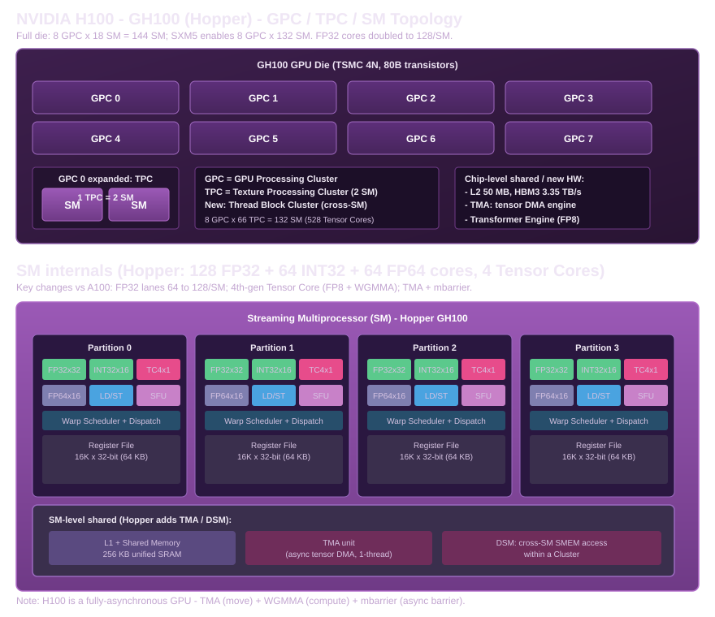

# NVIDIA Hopper H100（GH100）硬件结构深度解析

> 本手册是 [Part 1 概述](../part01-gpu-hardware-architecture.md) 的扩展篇，属于「逐型号 GPGPU 硬件结构」系列之一。同系列还有 [Ampere A100](01-ampere-a100.md) 与 [Blackwell B200](03-blackwell-b200.md)。
>
> 约定：本章**不出现 CUDA 代码**，只讲硬件结构、硬件 Feature，以及「算力从哪来」的推导。**重点回答一个问题：H100 相比 A100 改了什么、为什么这样改。**

## 0. 定位：H100 是"从 Warp 参与搬运，到专用硬件全权负责"的一次转向

H100（代号 GH100）发布于 2022 年，Hopper 架构的数据中心旗舰。如果 A100 解决的问题是"怎么把算力密度提上去"，那么 H100 解决的是 A100 提上去之后暴露出的新问题——**算力上来了，但"喂数据"这件事本身还在占用人力和发射带宽**。

A100 的 `cp.async` 实现了"异步"（不阻塞 Warp 继续执行），但**搬运仍然是 Warp 参与**的：32 个线程各自算地址、各自发指令。H100 的整个设计主线，就是把这些"本该由专用硬件干的活"从 Warp 手里接过来。这张表概括了它的三件大事：

| A100 遗留的问题（详见 A100 手册 §6）| H100 的对策 | 一句话 |
|---|---|---|
| 搬运仍是 Warp 参与（逐线程算地址）| **TMA**（Tensor Memory Accelerator）| 专用 DMA 引擎，单线程发起 |
| 协作颗粒度只有 Warp（32 线程）| **Warp Group + WGMMA** | 128 线程协作，更大 tile，操作数直接读 SMEM |
| 相邻 SM 无法共享数据 | **Thread Block Cluster + DSM** | 跨 SM 直接访问对方 Shared Memory |

这三者加上 FP8 / Transformer Engine，共同构成 H100 的"全异步 GPU"故事的硬件基础。

## 1. 芯片拓扑：更多 SM，且 FP32 数据通路翻倍



| 层级 | H100 SXM5 | A100（对照）| 变化 |
|---|---|---|---|
| GPC | 8 | 7 | +1 |
| TPC | 66 | 56 | +10 |
| SM | **132** | 108 | +22% |
| FP32 CUDA Core | 16896 | 6912 | **+144%**（每 SM 64→128）|
| FP64 CUDA Core | 8448 | 3456 | +144% |
| Tensor Core（第 4 代）| 528 | 432 | +22% |
| L2 Cache | 50 MB | 40 MB | +25% |
| 显存 | 80 GB HBM3 | 80 GB HBM2e | 类型升级 |
| 带宽 | 3.35 TB/s | 2.04 TB/s | +64% |

> 来源：[NVIDIA GH100 Whitepaper](https://www.techpowerup.com/gpu-specs/docs/nvidia-gh100-architecture.pdf)（8 GPC/66 TPC/132 SM/16896 FP32/528 TC）与 [Hopper In-Depth 官方博客](https://developer.nvidia.com/blog/nvidia-hopper-architecture-in-depth/)。

## 2. SM 内部：相对 A100 的四处关键改动

### 2.1 FP32 数据通路加倍（64 → 128 每 SM）

这是 H100 最容易被忽略、却对纯标量计算影响最大的一处改动。

回顾 A100 手册 §1.1：数据中心 A100（GA100）每 SM 是**分立的 64 FP32 + 64 INT32**。Hopper 把 FP32 通路**直接翻倍到 128/SM**（INT32 保持 64/SM），于是每 SM 每时钟能发射的 FP32 指令数翻倍。

> 这正是"为什么 H100 的 FP32 峰值是 A100 的 3.4 倍"的答案：128 vs 64（FP32 通路翻倍）× 132 vs 108（SM 数）× 1980 vs 1410 MHz（频率），三者相乘 ≈ 3.4×。

### 2.2 Tensor Core 升级到第 4 代：同格式每时钟 FMA 翻倍

第 4 代 Tensor Core 在**同一种精度下**，每时钟能做的 FMA 是第 3 代的 2 倍：

| 格式 | A100 FMA/SM/时钟 | H100 FMA/SM/时钟 |
|---|---|---|
| FP64（Tensor）| 64 | 128 |
| TF32 | 512 | 1024 |
| FP16 / BF16 | 1024 | **2048** |
| FP8 | —（无）| 4096 |
| INT8 | 2048 | 4096 |

（这些数的推导见 §4，全部能精确反推出官方峰值。）

### 2.3 引入 Tensor Memory Accelerator（TMA）—— 专用搬运 DMA

TMA 是 Hopper 最标志性的硬件新增。它是一个**内嵌在 SM 里的专用 DMA 引擎**，专职处理"规整张量块的全球↔共享内存搬运"：

- **单线程发起**：以前 `cp.async` 要 32 个线程各自算地址、各自发指令；TMA 只需要 1 个线程发一条描述符指令，硬件自动完成地址生成、边界检查、Shared Memory swizzle。
- **独立于 LD/ST Unit**：搬运不再占用 Warp 的指令发射带宽和寄存器。
- **配合 `mbarrier`**：TMA 的完成信号走异步事务屏障（transaction-based mbarrier），而非传统 `bar.sync`。

TMA 直接把 A100 遗留问题 1「搬运仍是 Warp 参与」彻底消灭——它对应 Part 3 §3.9 和 roadmap Track 2.3。

### 2.4 寄存器堆仍是 256 KB（这是下一代的伏笔）

关键的"没变"：**H100 的寄存器堆容量和 A100 一样，还是 256 KB/SM**（这个数字从 Kepler 起十年没变）。而 WGMMA 处理的 tile 更大了、累加器规模更大了——结果就是**累加器开始和普通数据抢寄存器**。这个问题 Hopper 没有解决，而是留给了 Blackwell 用 TMEM 去解决（见 B200 手册 §2.2）。理解这个"不变"很重要，它是 Hopper→Blackwell 演进的最直接动因。

## 3. 全异步 GPU 的三件套：TMA + WGMMA + mbarrier

H100 的硬件 Feature 可以归结为一条主线：**把计算（Tensor Core）和搬运（TMA）彻底解耦，各自走独立的异步流水线，用 mbarrier 协调**。

```
         ┌─────────────────────────────────────────────┐
         │              H100 SM 内部                      │
         │                                               │
 TMA  ───►  Shared Memory  ──操作数──►  Tensor Core(WGMMA) │
 (专用DMA)     (256KB SRAM)             (第4代,×2 FMA)     │
   ▲                                    │                 │
   │         mbarrier 协调              ▼                 │
   └──── 全局显存(HBM3)  ◄──── 累加结果(寄存器堆)         │
         └─────────────────────────────────────────────┘
```

三件套各自的角色：

| 单元 | 负责 | 对应的 A100 遗留问题 |
|---|---|---|
| **TMA** | 异步搬运（Global→SMEM），单线程发起 | 问题 1（Warp 参与搬运）|
| **WGMMA**（`wgmma.mma_async`）| 异步矩阵乘加，操作数直接读 SMEM，128 线程 Warp Group 协作 | 问题 2（协作颗粒度只有 Warp）|
| **mbarrier** | 异步完成信号（事务计数），替代 `bar.sync` | 支撑上面两者的异步语义 |
| **Cluster + DSM** | 跨 SM 直接访问对方 Shared Memory | 问题 3（相邻 SM 无法共享）|

这一套组合拳，就是后来 FlashAttention-3、CUTLASS 3.x 在 Hopper 上跑出高 Tensor Core 利用率的硬件基础（Warp Specialization 范式），详见 Part 4 §4.8、Part 12。

## 4. 算力公式：从硬件单元推导 H100 峰值

继续用 A100 手册 §4 的通用公式：

\[
\text{Peak FLOPS} = N_{\text{SM}} \times \text{FMA/时钟/SM} \times 2 \times f_{\text{clock}}
\]

H100 SXM5 有两个 boost clock（这是相对 A100 纯 1410 MHz 的一个新变化）：

| 频率域 | 数值 | 适用的运算 |
|---|---|---|
| 主 boost | **1830 MHz** | FP8/FP16/BF16/TF32 Tensor、非 Tensor 的 FP16/BF16 |
| 高 boost | **1980 MHz** | FP64 Tensor、FP32、FP64 非 Tensor |

> 来源：[GH100 Whitepaper §GPU Features 表](https://www.techpowerup.com/gpu-specs/docs/nvidia-gh100-architecture.pdf)（脚注：FP8/FP16/BF16/TF32 Tensor 用 1830 MHz；FP64 Tensor、FP32/FP64 非 Tensor 用 1980 MHz）。

### 4.1 CUDA Core（标量 FMA）

**FP32**（128 issue/SM × 132 SM × 1 次 FMA × 2 FLOP × 1980 MHz）：

```
FP32 = 132 × 128 × 2 × 1.98e9 = 16896 × 2 × 1.98e9
     = 6.69e13 FLOP/s ≈ 66.9 TFLOPS ✅
```

**FP64**（64/SM，恒为 FP32 一半）：

```
FP64 = 132 × 64 × 2 × 1.98e9 = 8448 × 2 × 1.98e9 ≈ 33.5 TFLOPS ✅
```

> 对比 A100 的 19.5 / 9.7，H100 FP32 提升 3.4×，正是 §2.1 的"issue 翻倍 + SM 数 + 频率"三者叠加。

### 4.2 Tensor Core（矩阵 MMA，主 boost 1830 MHz）

**FP16 / BF16**（每 SM 2048 FMA/时钟）：

```
FP16 = 132 × 2048 × 2 × 1.83e9 = 9.894e14 ≈ 989.4 TFLOPS ✅
```

**TF32**（每 SM 1024 FMA/时钟）：

```
TF32 = 132 × 1024 × 2 × 1.83e9 = 4.947e14 ≈ 494.7 TFLOPS ✅
```

**FP8**（每 SM 4096 FMA/时钟，第 4 代新增）：

```
FP8 = 132 × 4096 × 2 × 1.83e9 = 1.9789e15 ≈ 1978.9 TFLOPS (≈2 PFLOPS) ✅
```

**FP64 Tensor**（每 SM 128 FMA/时钟，高 boost 1980 MHz）：

```
FP64-TC = 132 × 128 × 2 × 1.98e9 = 6.69e13 ≈ 66.9 TFLOPS ✅
```

**INT8**（每 SM 4096 MAC/时钟，每个 MAC = 1 乘 + 1 加 = 2 个整数运算）：

```
INT8 = 132 × 4096 × 2 × 1.83e9 = 1.9789e15 ≈ 1978.9 TOPS ✅
```

> 稀疏（2:4）峰值在各 Tensor 格式上再 ×2（FP16 1978.9、FP8 3957.8、INT8 3957.8）。官方数据表口径如下。

### 4.3 巅峰性能全景表（SXM5）

| 格式 | 稠密 | 稀疏(2:4) | 对应公式 |
|---|---|---|---|
| FP64（非 Tensor）| 33.5 TFLOPS | — | §4.1 |
| FP64 Tensor | 66.9 TFLOPS | — | §4.2 |
| FP32（非 Tensor）| 66.9 TFLOPS | — | §4.1 |
| TF32 Tensor | 494.7 | 989.4 | §4.2 |
| FP16 Tensor | 989.4 | 1978.9 | §4.2 |
| BF16 Tensor | 989.4 | 1978.9 | §4.2 |
| **FP8 Tensor** | **1978.9** | **3957.8** | §4.2 |
| INT8 Tensor | 1978.9 | 3957.8 | §4.2 |
| FP16 / BF16（非 Tensor）| 133.8 | — | 2× FP32（packed FP16）|

> 来源：[NVIDIA H100 官方数据表](https://www.nvidia.com/en-gb/data-center/h100/)（FP64 34 / FP64-TC 67 / FP32 67 / TF32 989* / BF16 1979* / FP16 1979* / FP8 3958* / INT8 3958*；带 * 为稀疏口径；稠密即一半）。

## 5. H100 相对 A100 的改进总结：为什么这样改

把上面所有改动串成一条因果链，就是 H100 的价值主张：

```
A100 把算力提上去了(Tensor Core 3rd + TF32/BF16)
   │
   ▼  但"喂数据"仍是 Warp 在用手搬
H100 三大对策：
   1. TMA          —— 搬运交给专用 DMA，单线程发起（解放 Warp）
   2. WGMMA+WarpGroup —— 协作颗粒度 32→128 线程，tile 更大（匹配爆发的算力）
   3. Cluster/DSM  —— 相邻 SM 共享数据，减少冗余搬运
   │
   ▼  同时把精度下探一级，继续抬算力屋顶
FP8 + Transformer Engine —— 在 FP16 基础上再 ×2
```

**为什么每一项都要这样改**（逐条回答"为什么"）：

1. **为什么引入 TMA？** 因为 `cp.async` 虽然异步，但每个线程仍要自己算地址、发指令，这本身就在抢 Warp 的发射带宽和寄存器。当算力涨到几十万 FLOPS/时钟时，"逐线程手工搬运"的开销占比大到不可接受，必须用一块专用电路整体替代。
2. **为什么协作颗粒度要扩到 Warp Group（128 线程）？** 因为 Tensor Core 峰值翻倍后，Warp 级 `mma.sync`（32 线程）能处理的 tile 太小，不足以在单位时间里喂饱 Tensor Core，需要更大的集体协作来摊薄指令发射开销。WGMMA 还能让操作数直接从 Shared Memory 读，省掉 A100 必须走的 `ldmatrix` 中转。
3. **为什么要有 Cluster/DSM？** 因为现实中两个相邻 Block 常需要同一份数据，A100 上只能各自独立去 Global Memory 搬一遍，浪费带宽。让物理上相邻的 SM 直接互访 Shared Memory，能把这条冗余搬运链路砍掉。
4. **为什么精度下探到 FP8？** 延续 Ampere TF32 的"精度下探换吞吐"逻辑，这次引入 Transformer Engine 用**硬件级 per-tensor/per-vector 动态缩放**来兜底 FP8 的量化误差，让训练（不只推理）也能安全用上 FP8。

### 5.1 Roofline 视角：H100 的算术强度天花板更高了

```
AI_ridge(H100) = FP16-TC 峰值 / 带宽 = 989.4 TFLOPS / 3.35 TB/s ≈ 295 FLOP/Byte
```

相对 A100 的约 153，H100 的 Ridge Point 右移到约 295——**越来越多原本"算力受限"的 kernel 在 H100 上反而变成"访存受限"**。这正是 Part 10 反复强调的「算力增长(6×)远超带宽增长(1.6×)」矛盾的直接量化，也是为什么 H100 必须在 TMA/DSM 这些"搬运"机制上做文章的根本原因。

## 6. H100 的硬件 Feature 清单

| Feature | A100 | H100 | 说明 |
|---|---|---|---|
| Tensor Core 代次 | 第 3 代 | **第 4 代** | 同格式 FMA/时钟 ×2 |
| TF32 / BF16 | ✅ | ✅ | 继续支持 |
| FP8 | ❌ | ✅ | 第 4 代新增 + Transformer Engine |
| 2:4 稀疏 | ✅ | ✅ | 继续支持 |
| `cp.async` | ✅ | ✅ | 仍然可用，但被 TMA 取代为主流 |
| TMA | ❌ | ✅ | 专用张量 DMA |
| WGMMA / Warp Group | ❌ | ✅ | 128 线程协作 MMA |
| Cluster / DSM | ❌ | ✅ | 跨 SM 共享 Shared Memory |
| mbarrier | ❌ | ✅ | 异步事务屏障 |
| L2 Persisting | ✅ | ✅ | 继续支持 |
| MIG | ✅ | ✅ | 继续支持 |
| NVLink | 3.0 (600 GB/s) | **4.0 (900 GB/s)** | 互联带宽 +50% |

## 7. H100 留下的问题（伏笔：为什么需要 Blackwell）

H100 解决得很好，但仍然留下两个新问题，直接催生 Blackwell：

1. **累加器膨胀**：WGMMA 的 tile 更大了，累加结果占用的寄存器越来越多，但 256 KB/SM 的寄存器堆十年没涨，逐渐吃紧。
2. **精度下探到极限，需要更精细的硬件缩放**：FP8 是 Hopper 能提供的最低精度，继续往 FP4/FP6 走，朴素量化的误差大到不可接受，需要硬件配合更细粒度的缩放机制。

这两个问题分别对应 Blackwell 的 **TMEM** 和 **NVFP4 微块缩放**——下一章详述。

## 8. 参考资料与来源

- [NVIDIA GH100 Whitepaper](https://www.techpowerup.com/gpu-specs/docs/nvidia-gh100-architecture.pdf)：拓扑、双 boost clock、峰值表、FP64 33.5/FP64-TC 66.9/FP32 66.9/TF32 494.7/FP16 989.4/FP8 1978.9/INT8 1978.9。
- [NVIDIA H100 官方数据表](https://www.nvidia.com/en-gb/data-center/h100/)：FP64 34 / FP64-TC 67 / FP32 67 / TF32 989* / BF16 1979* / FP16 1979* / FP8 3958* / INT8 3958*，带宽 3.35 TB/s，NVLink 900 GB/s。
- [NVIDIA Hopper Architecture In-Depth 博客](https://developer.nvidia.com/blog/nvidia-hopper-architecture-in-depth/)：TMA/Cluster/DSM 的硬件说明。