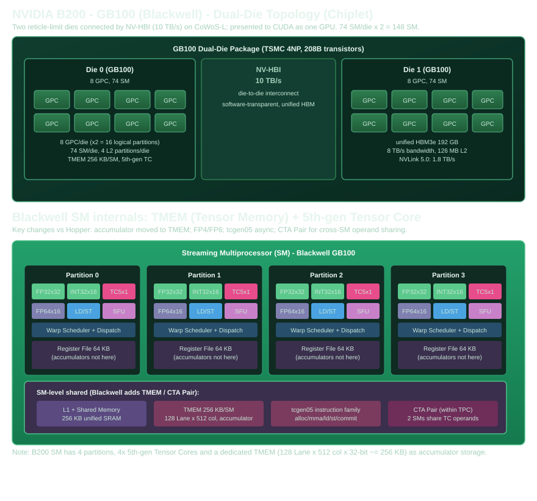

# NVIDIA Blackwell B200（GB100）硬件结构深度解析

> 本手册是 [Part 1 概述](../part01-gpu-hardware-architecture.md) 的扩展篇，属于「逐型号 GPGPU 硬件结构」系列之一。同系列还有 [Ampere A100](01-ampere-a100.md) 与 [Hopper H100](02-hopper-h100.md)。
>
> 约定：本章**不出现 CUDA 代码**，只讲硬件结构、硬件 Feature，以及「算力从哪来」的推导。**重点回答一个问题：B200 相比 H100 改了什么、为什么这样改。**
>
> ⚠️ 范围澄清：本章指的是 **数据中心 Blackwell（B100/B200，`sm_100a`）**。消费级 GeForce RTX 50 系列（`sm_120`）是另一颗设计差异很大的芯片，**没有** TMEM、CTA Pair 和 `tcgen05`，不要混为一谈（详见 Part 6 §6.6）。

## 0. 定位：B200 的三个"第一次"

B200（GB100）发布于 2024 年，是 Blackwell 架构的数据中心旗舰。它有三个"第一次"，直接决定了一切后续结构：

1. **第一次用双 Die（Chiplet）**：单片 die 撞上了光刻 reticle 极限（~800 mm²），无法在单一曝光场里继续做大。于是把两枚 reticle 极限的 die 并排封装在 CoWoS-L 基板上，用 **NV-HBI（10 TB/s 的 die-to-die 互联）** 连起来，对 CUDA 表现为**单一 GPU**（统一 HBM、统一 SM 集合、统一 NVLink 端口）。
2. **第一次给 Tensor Core 配专属存储（TMEM）**：把"累加器"从十年没涨过的寄存器堆里搬出来，放到一块专供 Tensor Core 用的 256 KB/SM 片上存储里。
3. **第一次把精度下探到 FP4/FP6**：用硬件级微块缩放（NVFP4）来兜底 4-bit 的量化误差。

如果 A100 解决"算力密度"、H100 解决"搬运交给专用硬件"，那么 B200 解决的是 H100 留下的两个新问题：**「累加器装不下寄存器堆」** 和 **「精度下探到 4/6 bit 需要硬件级缩放」**（见 H100 手册 §7）。

## 1. 芯片拓扑：双 Die + NV-HBI



| 层级 | B200（GB100 双 die）| H100（对照）| 变化 |
|---|---|---|---|
| 晶体管 | **208B**（2× ~104B）| 80B | +160% |
| 制程 | TSMC 4NP | TSMC 4N | 微缩 |
| Die 配置 | **双 die（Chiplet）** | 单 die | 首次 |
| die-to-die | NV-HBI 10 TB/s | —（单 die）| 新增 |
| SM | **148**（2×74）| 132 | +12% |
| FP32 CUDA Core | 18,944（148×128）| 16896 | +12% |
| Tensor Core（第 5 代）| 592（148×4）| 528 | +12% |
| L2 Cache | **126 MB** | 50 MB | +152% |
| 显存 | **192 GB HBM3e** | 80 GB HBM3 | +140% |
| 带宽 | **8 TB/s** | 3.35 TB/s | +139% |
| NVLink | **5.0（1.8 TB/s）** | 4.0（900 GB/s）| +100% |
| TDP | 1000 W | 700 W | +43% |

> 来源：晶体管/制程/双 die/NV-HBI 见 [NVIDIA Blackwell 官方页](https://www.nvidia.com/en-gb/data-center/technologies/blackwell-architecture/)；148 SM（74/die）与 L2 126 MB 见 [Chips and Cheese 的 B200 实测分析](https://chipsandcheese.com/p/nvidias-b200-keeping-the-cuda-juggernaut)（引用 NVIDIA Blackwell Tuning Guide）；峰值/显存见 [NVIDIA B200 数据表](https://www.primeline-solutions.com/media/categories/server/nach-gpu/nvidia-hgx-h200/nvidia-blackwell-b200-datasheet.pdf)；FP4 9,000 / FP8 4,500 / BF16 2,250 稠密见 [SemiAnalysis InferenceX B200](https://inferencex.semianalysis.com/chips/b200)。

### 1.1 为什么用双 Die 而不是做大单片？

这是 B200 最根本的设计决策，值得单独讲：

- **物理天花板**：GH100（Hopper）的 die 已经做到 ~814 mm²，接近 TSMC 光刻 reticle（单次曝光）能曝出的最大尺寸。Blackwell 无法再靠"单片做大"来堆晶体管——再大就超出 reticle 极限，必须切成两片。
- **良率**：两个 ~800 mm² 的中型 die，比一个 1600 mm² 的巨型 die 良率高得多、成本可控。
- **软件无感**：NV-HBI 提供 10 TB/s、近 die-local 的延迟，把两片 die 的 L2 统一成"分区式 L2"，对 CUDA 暴露成单一设备。Chips and Cheese 实测跨 die 的 L2 命中延迟惩罚很小——**"软件不用关心这是两片 die"这个承诺基本兑现**。

对比之下 AMD MI300X 用了 12-die 的激进方案，NVIDIA 则保守地只用 2 die——这是"保守但可靠地守住在 CUDA 生态里的优势"的策略，详见 [Chips and Cheese 的评论](https://chipsandcheese.com/p/nvidias-b200-keeping-the-cuda-juggernaut)。

## 2. SM 内部：相对 H100 的关键改动

一个 Blackwell SM 仍是 4 个 Processing Block（Partition），每个 Partition 一个 Warp Scheduler。相对 H100 的核心变化集中在**"累加器去哪了"**和**"Tensor Core 更宽了"**两件事上。

### 2.1 第 5 代 Tensor Core：同格式每时钟 FMA 再翻倍

和 H100 相对 A100 的翻倍逻辑一样，Blackwell 第 5 代 Tensor Core 在**同一种精度**下，每时钟的 MAC 又是 Hopper 的 2 倍：

| 格式 | A100 FMA/SM/时钟 | H100 FMA/SM/时钟 | B200 MAC/SM/时钟 |
|---|---|---|---|
| FP64（Tensor）| 64 | 128 | —（见 §4.3）|
| TF32 | 512 | 1024 | 2048 |
| FP16 / BF16 | 1024 | 2048 | **4096** |
| FP8 | — | 4096 | **8192** |
| FP4 | — | — | **16384** |
| INT8 | 2048 | 4096 | 8192 |

> 16-bit（FP16/BF16）的 4096 MAC/SM/时钟 = 1024 MAC/分区/时钟，来自 [Chips and Cheese 实测](https://chipsandcheese.com/p/nvidias-b200-keeping-the-cuda-juggernaut) 的陈述："Blackwell's CTA-level matrix instructions can sustain 1024 16-bit MAC operations per cycle, per partition."

### 2.2 TMEM（Tensor Memory）：累加器搬出寄存器堆

这是 Blackwell 最标志性的新增。回顾 H100 手册 §4.4 埋下的伏笔：**寄存器堆从 Kepler 起就是 256 KB/SM，十年没变**，而 WGMMA 的 tile 越来越大、累加器越来越占地方。Blackwell 的解法不是把寄存器堆做大（那样要动所有访存端口），而是**给 Tensor Core 单独配一块存储**：

| TMEM 属性 | 数值 |
|---|---|
| 容量 | **256 KB/SM**（约等于寄存器堆的 10% 规模）|
| 组织结构 | 128 Lane × 512 列 × 32-bit |
| 归属 | 专属 Tensor Core（矢量 ALU 无法直接读它做输入）|
| 生命周期 | 软件显式 `tcgen05.alloc` / `dealloc`（更像 Shared Memory 而非寄存器）|
| 拥有者 | 整个 CTA 共享（不再绑定到发起者的私有寄存器）|

**为什么这样改？** 因为把累加器移进 TMEM 后：(a) 寄存器堆不再为累加器预留空间，能驻留更多普通数据/线程；(b) TMEM 不用接到矢量 ALU 上，硬件可以简化；(c) 累加结果能跨 Warp Group 驻留、跨阶段复用，减少回写寄存器的搬运。这直接消除了 H100 遗留问题 1「累加器膨胀」。

> 来源：[NVIDIA Inside Blackwell（TMEM）](https://developer.nvidia.com/blog/inside-nvidia-blackwell-ultra-the-chip-powering-the-ai-factory-era/)；组织结构 128×512×32-bit 与"每分区 512 列 × 32 行"见 [Chips and Cheese](https://chipsandcheese.com/p/nvidias-b200-keeping-the-cuda-juggernaut)；[arXiv:2512.02189](https://arxiv.org/pdf/2512.02189)（Microbenchmarking Blackwell）§TMEM。

### 2.3 一个"倒退"：BF16/FP16 矢量速率不再翻倍

Chips and Cheese 实测发现一个反直觉的细节：**B200 的矢量化 FP16 不再像 H100 那样享受"2× FP32"的 packed 速率**（FP16 非 Tensor 吞吐 = FP32 非 Tensor 吞吐）。原因是 NVIDIA 判断 FP16 已经主要由 Tensor Core 完成，于是砍掉了矢量路径上的 packed-FP16 加速，把晶体管省下来给更宽的 Tensor Core。这是"通用性让位于领域专用"的又一次体现。

同样地，`tcgen05.mma` **不支持 FP64**（官方 PTX 文档列出的精度只有 tf32/f16/bf16/i8/u8/f4/f6/f8）——FP64 的 GEMM 走的是"翻倍的 FP64 矢量 ALU"这条独立路径（见 §2.1）。所以 B200 的 40 TFLOPS FP64 本质上是**双倍的 FP64 CUDA Core**，而不是 FP64 Tensor Core。

### 2.4 CTA Pair：TPC 级跨 SM 共享操作数

Blackwell 允许 TPC 内相邻两个 SM 上的 CTA 结成「CTA Pair」，**共享同一份 Tensor Core 输入操作数**——一份数据被 TMA 搬进其中一个 SM 的 Shared Memory 后，通过 TPC 内专用互联直接喂给两个 SM 的 Tensor Core，不用各自重复搬运。这可以看作 H100 Cluster/DSM 思想的进一步下沉：DSM 让 Block 共享 Shared Memory 中的数据，CTA Pair 让相邻 SM 共享 Tensor Core 操作数，链路更短、延迟更低。详见 Part 2 §2.10、Part 5 §5.12。

## 3. 新的异步流水线：tcgen05

配合 TMEM，Blackwell 引入了 `tcgen05` 指令族，形成一条全新的异步流水线（对比 H100 的 TMA+WGMMA）：

```
H100：  TMA → Shared Memory → wgmma.mma_async → 累加进【寄存器堆】 → 写回
B200：  TMA → Shared Memory → tcgen05.mma      → 累加进【TMEM】    → tcgen05.ld 取回寄存器
```

两个关键变化：

1. **结果归宿变了**：从"发起者私有寄存器"换成"CTA 共享的 TMEM"，因此累加器不再挤占寄存器。
2. **发起颗粒度放松了**：H100 的 `wgmma.mma_async` 必须整个 Warp Group（128 线程）集体发起（因为结果要落到发起者 Warp 的私有寄存器）；Blackwell 某些 `tcgen05.mma` 变体**单线程就能发起**（结果进 TMEM，不再受"发起者=结果拥有者"约束）。注意：这说的是**发起粒度**放松，不等于任意线程可无条件触发任意 Tensor 操作，完整边界见 Part 6 §6.6。

## 4. 算力公式：从硬件单元推导 B200 峰值

继续用通用公式：

\[
\text{Peak FLOPS} = N_{\text{SM}} \times \text{MAC/时钟/SM} \times 2 \times f_{\text{clock}}
\]

**关于 B200 的频率**：NVIDIA 没有像 H100 那样公开单一 boost clock，但可以用官方峰值反推。反推结果是**两个时钟域**：矢量/CUDA 运算约 **2.11 GHz**，Tensor 运算约 **1.86 GHz**（与 H100 SXM5 同期水平接近，也与 [Chips and Cheese](https://chipsandcheese.com/p/nvidias-b200-keeping-the-cuda-juggernaut) 的"clock similar to H100 SXM5"吻合）。下面每个公式都会把隐含时钟列出来，你能看到它们自我一致。

### 4.1 CUDA Core（标量 FMA）

**FP32**（148 SM × 128 core/SM，每 core 每时钟 1 FMA）：

```
FP32 = 148 × 128 × 2 × 2.11e9 = 37888 × 2.11e9 ≈ 80 TFLOPS ✅
```

**FP64**（148 × 64，恒为 FP32 一半，Blackwell 把 FP64 ALU 翻倍了）：

```
FP64 = 148 × 64 × 2 × 2.11e9 = 18944 × 2.11e9 ≈ 40 TFLOPS ✅
```

> 来源：[NVIDIA B200 数据表](https://www.primeline-solutions.com/media/categories/server/nach-gpu/nvidia-hgx-h200/nvidia-blackwell-b200-datasheet.pdf)（FP32 80、FP64/FP64-TC 40）。

### 4.2 Tensor Core（矩阵 MMA，tensor clock ≈ 1.86 GHz）

**FP16 / BF16**（每 SM 4096 MAC/时钟）：

```
FP16 = 148 × 4096 × 2 × 1.8558e9 ≈ 2.25e15 = 2250 TFLOPS ✅
```

**TF32**（每 SM 2048，FP16 的一半）：

```
TF32 = 148 × 2048 × 2 × 1.8558e9 ≈ 1125 TFLOPS ✅
```

**FP8**（每 SM 8192）：

```
FP8 = 148 × 8192 × 2 × 1.8558e9 ≈ 4500 TFLOPS ✅
```

**FP4**（每 SM 16384）：

```
FP4 = 148 × 16384 × 2 × 1.8558e9 ≈ 9000 TFLOPS ✅
```

**INT8**（每 SM 8192 MAC，每个 MAC = 1 乘 + 1 加 = 2 个整数运算）：

```
INT8 = 148 × 8192 × 2 × 1.8558e9 ≈ 4500 TOPS ✅
```

> 上面所有数字都是 **稠密（dense）**口径。带 2:4 稀疏的格式再 ×2（FP16 4500、FP8 9000、FP4 18000、INT8 9000）。这正是为什么不同来源会出现"2250 vs 4500"这种二倍差异——它们是 dense / sparse 两种口径，不是矛盾。

### 4.3 巅峰性能全景表（B200 SXM，稠密）

| 格式 | 稠密峰值 | 稀疏(2:4) | 公式来源 |
|---|---|---|---|
| FP64（矢量）| 40 TFLOPS | — | §2.1（无独立 FP64 Tensor 路径）|
| FP32（矢量）| 80 TFLOPS | — | §2.1 |
| TF32 Tensor | 1125 TFLOPS | 2250 | §2.2 |
| FP16 / BF16 Tensor | 2250 TFLOPS | 4500 | §2.2 |
| FP8 Tensor | 4500 TFLOPS | 9000 | §2.2 |
| **FP4 Tensor** | **9000 TFLOPS** | **18000** | §2.2 |
| FP6 Tensor | ~5300 TFLOPS* | ~10600* | 实测反推（见下）|
| INT8 Tensor | 4500 TOPS | 9000 | §2.2 |

> `*` FP6（e3m2/e2m3）是 Blackwell 新增格式，NVIDIA 数据表通常把 FP8/FP6 合并列出（如 "FP8/FP6 10 PF 稀疏"）。[arXiv:2512.02189](https://arxiv.org/pdf/2512.02189) 实测 FP6 达 5134.8 TFLOPS（95.8% 峰值），即 FP6 峰值约 5300 TFLOPS，介于 FP8（4500）与 FP4（9000）之间。

### 4.4 一个公式立刻看穿"为什么 B200 能到 9000 TFLOPS"

对比三代 Fan-out 峰值最高的那个格式（H100 是 FP8，B200 是 FP4）：

```
B200 FP4 = 148 SM × 16384 MAC × 2 × 1.86 GHz = 9000 TFLOPS
H100 FP8 = 132 SM ×  4096 MAC × 2 × 1.83 GHz = 1978.9 TFLOPS
```

9000 / 1978.9 ≈ **4.5×**。这 4.5× 拆解为三个乘法因子的乘积：

\[
\frac{148}{132}\ (\text{SM 数}) \times \frac{16384}{4096}\ (\text{每 SM MAC：FP4 精度下探}) \times \frac{1.86}{1.83}\ (\text{频率，基本不变}) \approx 1.12 \times 4 \times 1.0 \approx 4.5\times
\]

**结论：B200 相对 H100 的 4.5× 峰值，几乎全部来自"精度下探 FP8→FP4"这一个 4× 因子**，SM 数和频率的贡献微乎其微。这正是 Part 3 三条主线里「精度持续下探」主线的顶点——但代价是 FP4 需要 NVFP4 微块缩放才能保持可用精度（见 §5）。

## 5. B200 相对 H100 的改进总结：为什么这样改

```
H100 遗留问题 1：累加器膨胀，寄存器堆(256KB,十年未变)装不下
        └→ TMEM：累加器搬出寄存器堆，专属 256KB/SM 存储
H100 遗留问题 2：精度下探到 FP8 见底，再往 4/6 bit 量化误差不可接受
        └→ NVFP4：硬件级两级微块缩放，兜底 4-bit 精度
单片 die 撞 reticle 极限(~800mm²)
        └→ 双 die Chiplet + NV-HBI(10TB/s)，软件无感
```

**逐条回答"为什么"**：

1. **为什么用 TMEM？** 因为寄存器堆十年没涨（256KB/SM），直接做大要动整条访存端口，代价太高；而累加器的访问模式非常规律（无非是"读写累加结果"），完全可以隔离到一块专属存储里。TMEM 还能让结果跨 Warp Group 驻留、减少回写搬运——[arXiv:2512.02189](https://arxiv.org/pdf/2512.02189) 实测 FP64 GEMM 效率因此提升了 ~45%。

2. **为什么精度敢下探到 FP4？** 延续"精度↓吞吐↑"的剪刀差逻辑，但 FP4 的朴素量化误差已大到不可用，必须靠硬件来兜底——**NVFP4** 用两级缩放（16 个 FP4 值共享一个 FP8 微块缩放因子，再叠一个张量级 FP32 缩放），把误差控制在可用范围内。这是"精度下探"这条主线第一次需要**专门的硬件缩放电路**配合，不再是 TF32 那样"几乎透明"。

3. **为什么引入 `tcgen05`（单线程发起）？** 因为结果去 TMEM 之后，"发起者必须是结果拥有者"这个约束消失了——这让单个线程就能发起 MMA，进一步把指令发射开销摊薄，配合 Warp Specialization 更灵活。

4. **为什么用双 Die？** 见 §1.1，是纯粹的物理天花板（reticle 极限）+ 良率权衡。

### 5.1 Roofline 视角：B200 用 FP4 时，算术强度天花板又被抬高

```
AI_ridge(B200, FP16) = 2250 TFLOPS / 8 TB/s ≈ 281 FLOP/Byte
AI_ridge(B200, FP4)  = 9000 TFLOPS / 8 TB/s ≈ 1125 FLOP/Byte
```

带宽从 3.35→8 TB/s 增长了 2.4×，但 FP4 峰值从（H100 无 FP4，用 FP8 对比）1978.9→9000 增长了 4.5×——**算力增速再次超过带宽增速**。结论和 H100 一步一样甚至更尖锐：**在 B200 上，除了大 GEMM/Attention 之外，绝大多数 kernel 都是 Memory Bound**。这也是为什么 LLM 推理的 token/s 更多由 8 TB/s 带宽决定，而不是 9000 TFLOPS 的 FP4 峰值（详见 [SemiAnalysis 的分析](https://inferencex.semianalysis.com/chips/b200)）。

## 6. B200 的硬件 Feature 清单

| Feature | A100 | H100 | B200 | 说明 |
|---|---|---|---|---|
| Tensor Core 代次 | 3rd | 4th | **5th** | 同格式 MAC/时钟 逐代 ×2 |
| FP4 / FP6 | ❌ | ❌ | ✅ | NVFP4 微块缩放兜底精度 |
| FP8 | ❌ | ✅ | ✅ | 继续支持 |
| TF32 / BF16 / FP16 | ✅ | ✅ | ✅ | 继续支持 |
| TMEM | ❌ | ❌ | ✅ | 累加器专属存储 256KB/SM |
| `tcgen05` 指令族 | ❌ | ❌ | ✅ | 异步 MMA + TMEM 生命周期 |
| TMA | ❌ | ✅ | ✅ | 继续支持 |
| WGMMA | ❌ | ✅ | ✅ | 仍可用，但主流转向 tcgen05 |
| Cluster / DSM | ❌ | ✅ | ✅ | 继续支持 |
| CTA Pair | ❌ | ❌ | ✅ | TPC 内双 SM 共享操作数 |
| 硬件解压缩引擎 | ❌ | ❌ | ✅ | LZ4/Snappy 等权重解压 |
| 2:4 稀疏 | ✅ | ✅ | ✅ | 继续支持 |
| 双 Die Chiplet | ❌ | ❌ | ✅ | NV-HBI 10 TB/s |
| NVLink | 3.0 | 4.0 | **5.0 (1.8 TB/s)** | 互联带宽翻倍 |

> 关于"消费级 vs 数据中心"：上表列的 TMEM / `tcgen05` / CTA Pair **只存在于数据中心 Blackwell**（B100/B200，`sm_100a`）。RTX 50 系列（`sm_120`）没有 TMEM，低精度 MMA 走 `mma.sync.aligned.block_scale` 这条寄存器/Shared 路径，详见 Part 6 §6.6。

## 7. 参考资料与来源

- [NVIDIA Blackwell Architecture 官方页](https://www.nvidia.com/en-gb/data-center/technologies/blackwell-architecture/)：208B 晶体管、双 die、NV-HBI 10 TB/s。
- [NVIDIA B200 数据表](https://www.primeline-solutions.com/media/categories/server/nach-gpu/nvidia-hgx-h200/nvidia-blackwell-b200-datasheet.pdf)：FP32 80 / FP64 40 / TF32 2.5PF(稀疏) / FP16 5PF(稀疏) / FP8-6 10PF(稀疏) / FP4 20PF(稀疏)，HBM3e 192GB/8TB/s，NVLink5 1.8TB/s。
- [SemiAnalysis — InferenceX B200](https://inferencex.semianalysis.com/chips/b200)：FP4 9000 / FP8 4500 / BF16 2250（稠密）。
- [Chips and Cheese — Nvidia's B200](https://chipsandcheese.com/p/nvidias-b200-keeping-the-cuda-juggernaut)：148 SM（74/die）、1024 16-bit MAC/分区/时钟、L2 126MB、TMEM 组织结构、FP16 矢量不再 packed、FP64 走矢量路径。
- [Inside NVIDIA Blackwell Ultra（TMEM/第 5 代 TC/NVFP4 官方博客）](https://developer.nvidia.com/blog/inside-nvidia-blackwell-ultra-the-chip-powering-the-ai-factory-era/)。
- [arXiv:2512.02189 — Microbenchmarking NVIDIA's Blackwell Architecture](https://arxiv.org/pdf/2512.02189)：TMEM 延迟/带宽、FP6 实测吞吐、FP64 GEMM 效率提升归因。

> 说明：B200 官方数据表未公布单一 boost clock，本文的 ~1.86 GHz（Tensor）/ ~2.11 GHz（CUDA）是从官方峰值反推的自洽值，第三方（Chips and Cheese）亦确认"时钟与 H100 SXM5 同期"。若你看到不同来源的 2,250 vs 4,500 这类差异，多为 **dense vs sparse** 或 **peak clock 口径**不同，并非硬件参数冲突。